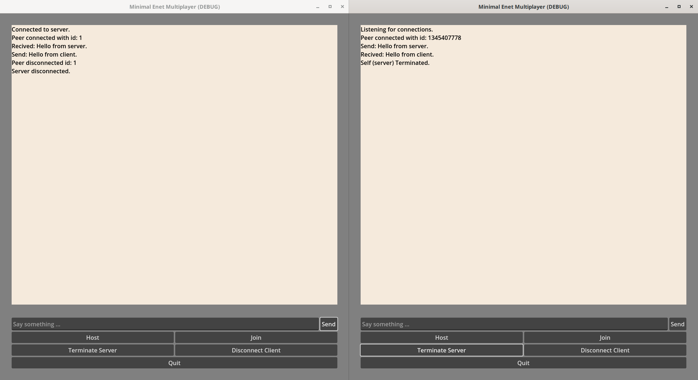

This is a simple Godot project to demonstrate server-client connection on high-level API with UDP based ENet library.
It contains a basic chat functionallity and displays connection changes.

This is just a minimal example.
Open two instances, one to host and one to join.
The UI is not polished.
For example, if you join a server client you can still click the "Terminate Server"-button which does nothing in that case.
